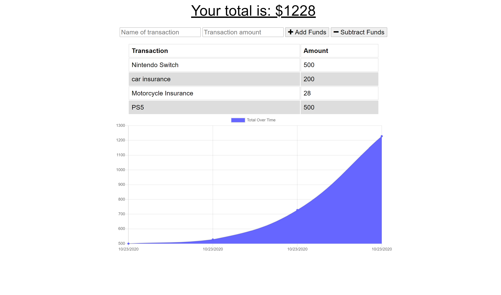

# Budget Tracker

## User Story

AS AN avid traveller
I WANT to be able to track my withdrawals and deposits with or without a data/internet connection
SO THAT my account balance is accurate when I am traveling

## Business Context

Giving users a fast and easy way to track their money is important, but allowing them to access that information anytime is even more important. Having offline functionality is paramount to our applications success.

## DESCRIPTION

For anyone needed a place to easily track their budget, this is a great application to do so. You can add expenses and remove expenses and chart will show you your spending habits in an easy to read format! You can also use this application online AND offline! How Awesome, right?

## TABLE OF CONTENTS

\*[License](#License)

\*[Contributing](#Contributing)

\*[Questions](#Questions)

## LAYOUT

Check out the deployed Heroku site!

https://powerful-basin-34224.herokuapp.com/

Here's what the application looks like!

## LICENSE

This application is licensed under the MIT license.

Find out more about the license here:

(https://opensource.org/licenses/MIT)

## CONTRIBUTING

I want to thank the other classmates from the Boot Camp, who once again, as we always do, came together to work as a team, answer questions anyone else had, and helped however they could!

## QUESTIONS

For any questions, contact me:

Github: https://www.github.com/jamjon94

email: jamie.mar.jones14@gmail.com
